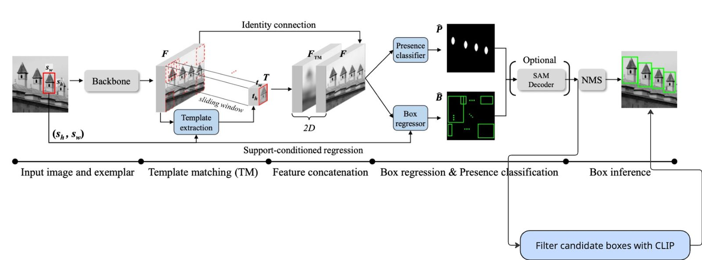
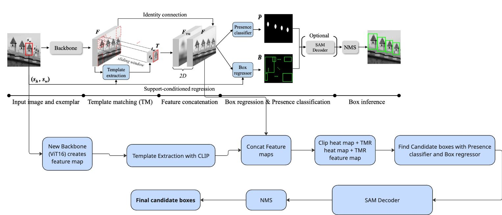

# Clip Based Few-Shot Pattern Detection via Template Matching and Regression (ICCV25 Highlight)

**Eunchan Jo**,
[**Dahyun Kang**](https://dahyun-kang.github.io),
[**Sanghyun Kim**](https://oreochocolate.github.io/),
**Yunseon Choi**,
[**Minsu Cho**](https://cvlab.postech.ac.kr/~mcho/)

Official implementation of "Few-Shot Pattern Detection via Template Matching and Regression", <br> 
✨ ICCV 2025 (Highlight) ✨

[[Project Page]](https://chipmunk-g4.github.io/TMR/)
[[Paper]](https://arxiv.org/abs/2508.17636)
[[Dataset]](https://huggingface.co/datasets/ChipmunkG4/RPINE)
[[Model weights]](https://huggingface.co/ChipmunkG4/TMR_weights)

<a href="https://arxiv.org/abs/2508.17636"></a>
<!-- <a href="https://huggingface.co/ChipmunkG4/TMR_weights" target="_blank"></a> -->

</div>

## Overview

<p align="center">
    
</p>

## Installation and Data & Backbone weights Preparation
#### Note: this released version was tested on Python == 3.11.9, Pytorch == 2.4.0 and cuda == 12.1.

Install python dependencies:
```
pip install -r requirements.txt
```

The NaCLIP source is vendored as a git submodule under `third_party/naclip`, and
`models/backbone/clip/naclip_vit.py` loads it from there. Clone with it, or fetch
it after the fact:
```
git clone --recurse-submodules https://github.com/BartuCan02/Clip-Based-Template-Matching.git
# or, in an existing clone:
git submodule update --init
```

#### * Data preparation
You can download **FSCD-147** and **FSCD-LVIS** datasets from the [Counting-DETR](https://github.com/VinAIResearch/Counting-DETR) repository.

You can download **RPINE** dataset form this [link](https://huggingface.co/datasets/ChipmunkG4/RPINE).

```
git clone https://huggingface.co/datasets/ChipmunkG4/RPINE data/RPINE
```

#### * Paths used by the scripts

The scripts in `scripts/` take their paths from environment variables with
repo-relative defaults, so they run unmodified from the repository root. Override
any of them if your data lives elsewhere:

| Variable | Default | Used for |
|---|---|---|
| `RPINE_DATA` | `data/RPINE` | RPINE dataset root |
| `FSC147_DATA` | `data/FSC147` | FSC-147 dataset root |
| `FSCD_LVIS_DATA` | `data/FSCD_LVIS` | FSCD-LVIS dataset root |
| `TMR_BASELINE_CKPT` | `weights/TMR_RPINE_baseline/best_model.ckpt` | checkpoint the text models fine-tune from, and the one `scripts/eval/TMR_RPINE.sh` evaluates |
| `TMR_MULTIMODAL_CKPT` | `weights/TMR_RPINE_Multimodal_finetune_150epoch/best_model.ckpt` | checkpoint the three `..._Mutimodal_finetune_*` eval scripts evaluate |
| `TMR_FINETUNE_CKPT` | `weights/TMR_RPINE_finetune_decoder_and_heads_30epoch/best_model.ckpt` | checkpoint `scripts/eval/TMR_RPINE_finetune_decoder_and_head.sh` evaluates |
| `NACLIP_PATH` | `third_party/naclip` | NaCLIP checkout put on `PYTHONPATH` |
| `WANDB_ENTITY` | *(your default entity)* | W&B team to log to. Our runs used `nlp-project-tum`; pass `--nowandb` to log to CSV instead |

```bash
RPINE_DATA=/mnt/datasets/RPINE sh scripts/train/TMR_RPINE.sh
```

#### * Backbone weights preparation
You can download SAM backbone weights from the [SAM-HQ](https://github.com/SysCV/sam-hq?tab=readme-ov-file) and [SAM](https://github.com/facebookresearch/segment-anything?tab=readme-ov-file#model-checkpoints) repositories.

```
wget -O sam_hq_vit_b.pth https://huggingface.co/lkeab/hq-sam/resolve/main/sam_hq_vit_b.pth

wget -O sam_hq_vit_h.pth https://huggingface.co/lkeab/hq-sam/resolve/main/sam_hq_vit_h.pth

wget -O sam_vit_h_4b8939.pth https://dl.fbaipublicfiles.com/segment_anything/sam_vit_h_4b8939.pth
```


Place them in the `checkpoints` folder as shown in the 'Main Repository Structure' section below.


## Main Repository Structure
```
Template-Matching-And-Regression/
├── checkpoints/                      # place backbone checkpoints here
│   ├── sam_hq_vit_b.pth
│   ├── sam_hq_vit_h.pth
│   └── sam_vit_h_4b8939.pth
│   
├── weights\                          # place TMR weights here
│   ├── TMR_RPINE/best_model.ckpt
│   ├── TMR_FSCD147/best_model.ckpt
│   ├── TMR_FSCD_LVIS_seen/best_model.ckpt
│   └── TMR_FSCD_LVIS_unseen/best_model.ckpt
│   
├── scripts\                          
│   ├── train
│   └── eval
│   
└── others...

```

## Model weights

Download the pre-trained model weights from this [link](https://huggingface.co/ChipmunkG4/TMR_weights) and place them in the `weights` folder.

```
mkdir -p weights/TMR_RPINE
wget -O weights/TMR_RPINE/best_model.ckpt https://huggingface.co/ChipmunkG4/TMR_weights/resolve/main/TMR_RPINE/best_model.ckpt
```

The text-conditioned scripts fine-tune from this checkpoint via
`$TMR_BASELINE_CKPT`, which defaults to `weights/TMR_RPINE_baseline/best_model.ckpt`.
If you use the published checkpoint above rather than one you trained yourself,
point the variable at it:

```bash
export TMR_BASELINE_CKPT=weights/TMR_RPINE/best_model.ckpt
```

## Demo

```
python demo.py --ckpt ./weights/TMR_FSCD147/best_model.ckpt
```

## NaCLIP Heatmap Demo

<p align="center">
    
</p>

Visualise NaCLIP patch-level similarity for any image and text prompt — no model weights required.

**Install minimal dependencies** (Python 3.11 recommended; tested with PyTorch 2.4.0):

```bash
pip install torch torchvision numpy matplotlib Pillow git+https://github.com/openai/CLIP.git
```

**Run:**

```bash
python demos/naclip_demo.py --image demo/5.jpg --text "a picture of an egg"
python demos/naclip_demo.py --image demo/5.jpg --text "a picture of an egg" --save out.png
```

| Argument | Default | Description |
|---|---|---|
| `--image` | *(required)* | Path to input image |
| `--text` | *(required)* | Target class to localise |
| `--background` | `"background"` | Background class for two-class softmax |
| `--logit_scale` | `40` | Softmax temperature (matches NACLIP paper) |
| `--sigma` | `5.0` | Gaussian kernel std for attention bias (patch units) |
| `--save` | *(none)* | Optional path to save the figure |

The demo shows the input image, patch probabilities (14×14), a heatmap overlay, and the top-5 matching patches.

## Training and Testing
### Training
Please change the `--datapath` argument to your own path where you have stored the dataset.

```
sh scripts/train/TMR_RPINE.sh
sh scripts/train/TMR_FSCD147.sh
sh scripts/train/TMR_FSCD_LVIS_Seen.sh
sh scripts/train/TMR_FSCD_LVIS_Unseen.sh
```

For detailed argument descriptions, please refer to `main.py`.

### Testing
`main.py` loads the checkpoint to evaluate by listing `--logpath`, so an eval run's
output directory must already contain the checkpoint. The RPINE eval scripts do this
staging step for you (they `mkdir` the output directory and copy the checkpoint named
by the `*_CKPT` variables above into it). For the FSCD-147 / FSCD-LVIS scripts, create
the folder and copy the checkpoint in yourself, then point `--logpath` at it.

You can add the `--refine_box` argument to evaluate with the SAM decoder box refinement setting.

```
sh scripts/eval/TMR_RPINE.sh
sh scripts/eval/TMR_FSCD147.sh
sh scripts/eval/TMR_FSCD_LVIS_Seen.sh
sh scripts/eval/TMR_FSCD_LVIS_Unseen.sh
```

You can check the descriptions of all arguments used in the scripts by referring to `main.py`.


## NLP Practical Project: text-conditioned TMR

This fork extends TMR so that detection can be driven by a **text prompt**, an
**exemplar box**, or **both**. The report for the project (ACL format) lives in
the companion repo `nlp-report` under `report/`.

**Team:** Bartu Can, Kilian Haas, Xiaohan Zhong. **Supervisor:** Frederic Mrozinski.

### Where to find what

The report compares four approaches. Three of them are implemented in this tree;
the numbering below is the report's, so the two documents can be read side by side.

| Approach | Key files |
|---|---|
| 1. **CLIP semantic re-ranking** (eval-time score fusion, supports negative prompts) | [`utils/clip_utils.py`](utils/clip_utils.py), [`trainer.py`](trainer.py), [`scripts/eval/examples_clip_reranking.sh`](scripts/eval/examples_clip_reranking.sh) |
| 2. **Simple multiplicative fusion** (`F_cat * (1 + 2M)`, training-free) | [`models/matching_net_simpleFusion.py`](models/matching_net_simpleFusion.py), [`inference_simpleFusion.py`](inference_simpleFusion.py) |
| 3. **1x1 convolutional adapter** (preliminary, abandoned before a full benchmark run) | *not implemented in this tree* |
| 4. **1025-channel fusion** (main result): NaCLIP heatmap concatenated as an extra channel, learnable placeholders, modality dropout | [`models/matching_net.py`](models/matching_net.py), [`models/naclip_wrapper.py`](models/naclip_wrapper.py), [`trainer.py`](trainer.py) |

Approach 4 is what the default code path runs. Approach 1 is off unless you pass
`--use_clip`. Approach 2 is a standalone variant: `models/matching_net_simpleFusion.py`
is a drop-in replacement for `models/matching_net.py` (same `matching_net` class),
so copy it over that file before running `inference_simpleFusion.py`.

Other things worth knowing:

- [`models/backbone/clip/naclip_vit.py`](models/backbone/clip/naclip_vit.py) is the NaCLIP ViT (Gaussian
  neighbourhood attention bias, no FFN/residual in the last block).
- [`models/naclip_wrapper.py`](models/naclip_wrapper.py) turns a class name into a dense
  `[B, 1, H, W]` probability heatmap (80-template prompt ensembling, two-class softmax vs. `"background"`).
- [`data/class_labels.json`](data/class_labels.json) holds the **manually corrected** RPINE text labels;
  [`data/class_labels_pre_annotated.json`](data/class_labels_pre_annotated.json) holds the raw
  GPT-generated ones. 618 of 4,360 entries (14.2%) differ. Keys are `"{split}/{img_name}"`;
  the `test` split reads the `val` keys.
- [`datamodules/datasets/RPINE.py`](datamodules/datasets/RPINE.py) attaches the label to each batch
  under `"label"`, which `trainer.py` feeds to NaCLIP.
- Validation visualisations are not committed (they are ~170 MB of JPEGs). Regenerate
  them by passing `--visualize` to any eval script; they land in `image_visualize_*/`.

### Extra setup for the text path

NaCLIP must be importable. The scripts already put the vendored submodule on
`PYTHONPATH` for you; only do this by hand if you are running `main.py` directly:

```bash
export PYTHONPATH="third_party/naclip:$PYTHONPATH"
```

This deliberately shadows the pip-installed `clip` package with NaCLIP's fork,
which is what provides the `visual.set_params(...)` API that
`models/naclip_wrapper.py` calls. Both are needed: `requirements.txt` installs
OpenAI CLIP (for the weights and tokenizer) and the submodule supplies the
patched attention.

Approach 1 needs the opposite: NaCLIP's `VisionTransformer.forward` refuses to
run until `set_params()` has been called, so re-ranking cannot use the fork.
`utils/clip_utils.py` handles this by importing the genuine OpenAI CLIP with the
NaCLIP entries removed from `sys.path`, then restoring the module table. Both
approaches therefore work in one process and `--use_clip` is safe to combine
with `--use_naclip_heatmap`.

The scripts below assume the TMR RPINE baseline checkpoint sits at
`weights/TMR_RPINE_baseline/best_model.ckpt` (see *Model weights* above); the
text-conditioned models are fine-tuned from it.

### Running our experiments

Baseline (no text), for reference:

```bash
sh scripts/train/TMR_RPINE.sh
sh scripts/eval/TMR_RPINE.sh
```

**Approach 4, multimodal fine-tuning** (uniform 1/3 modality dropout, decoders +
heads + placeholders trainable, backbone frozen). As shipped, the script trains the
150-epoch row into `weights/TMR_RPINE_Multimodal_finetune_150epoch`:

```bash
sh scripts/train/TMR_RPINE_Multimodal_finetune.sh
```

For the other rows of the results table, change **both** `--max_epochs` (to 30/50/100)
and `--logpath` to match: training asserts that `--logpath` does not already exist, so
each row needs its own directory. Point `$TMR_MULTIMODAL_CKPT` at that directory's
`best_model.ckpt` when evaluating it.

**Approach 4, single-mode fine-tuning** (text always present, no modality dropout).
This is the 35.47 AP row:

```bash
sh scripts/train/TMR_RPINE_finetune.sh
```

Evaluate one checkpoint in each of the three query modes:

```bash
sh scripts/eval/TMR_RPINE_Mutimodal_finetune_box_only.sh
sh scripts/eval/TMR_RPINE_Mutimodal_finetune_text_only.sh
sh scripts/eval/TMR_RPINE_Mutimodal_finetune_box_and_text.sh
```

The relevant flags in `main.py` are:

| Flag | Meaning |
|---|---|
| `--use_naclip_heatmap` | Enable the 1025th (NaCLIP) channel |
| `--use_modality_dropout` | Randomly pick box_only / text_only / box_and_text per training sample |
| `--input_mode` | Fixed query mode at eval: `box_only`, `text_only`, `box_and_text` |
| `--finetune_decoders_and_heads_only` | Freeze everything except decoders, heads and the two placeholders |
| `--finetune_from` | Checkpoint to initialise from (shape-mismatched decoders are re-initialised) |
| `--visualize` | Write per-image GT/prediction overlays to `image_visualize_*/` |

**Approach 1, CLIP re-ranking** (eval only, needs `--use_clip` and `--text_prompt`):

```bash
sh scripts/eval/examples_clip_reranking.sh   # prints ready-to-copy commands
```
Relevant flags: `--use_clip`, `--text_prompt`, `--negative_prompt`, `--clip_model`,
`--clip_alpha`, `--clip_beta`, `--clip_topk`, `--clip_threshold`.

**Approach 2, simple fusion** (training-free; first copy
`models/matching_net_simpleFusion.py` over `models/matching_net.py`):

```bash
python inference_simpleFusion.py            # add --log-stats for the per-layer
                                            # f_cat statistics behind the report's
                                            # distribution-shift analysis
```

## Citation

If you find this work useful for your research, please cite our paper:

```bibtex
@inproceedings{jo2025tmr,
  title     = {Few-Shot Pattern Detection via Template Matching and Regression},
  author    = {Eunchan Jo, Dahyun Kang, Sanghyun Kim, Yunseon Choi, and Minsu Cho},
  booktitle = {International Conference on Computer Vision (ICCV)},
  year      = {2025},
}
```# clip-based-template-matching
